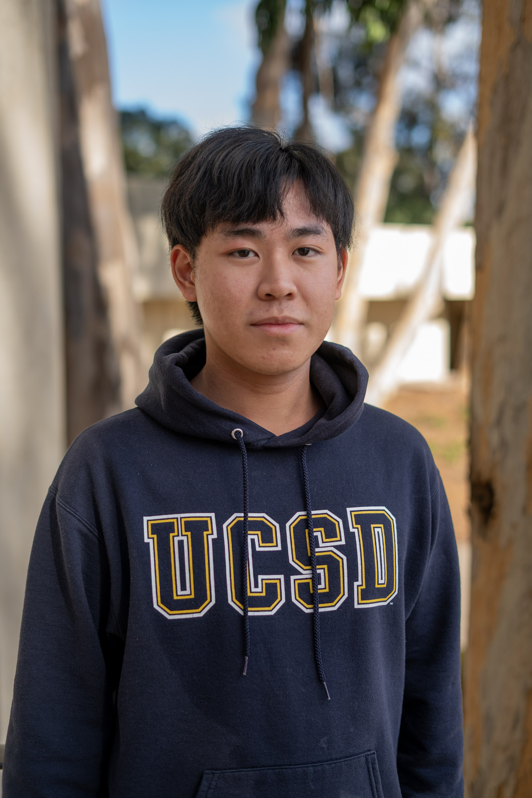

# Jan Kwong
## Third Year Computer Science Student @ UCSD

**Hello, everyone! My name is Jan!**

I am currently an undegraduate student at UC San Diego majorng in Computer Science and minoring in Cognitive Science. 

### A Little about _Me_:

I was raised in Hong Kong but also have lived in New York for a while before coming to San Diego! The varying cultures and lifestyles of the three cities have really shaped who I am today! I do miss the hustles and bustles in New York and Hong Kong, but the more laid-back and relaxing atmosphere in San Diego is also enjoyable. 

Besides being a student, I am also a homecook! As someone who really likes eating and trying out different cuisines, I enjoy cooking wholeheartedly! Even though I may not be a very proficient cook, I like experimenting with different dishes from various cuisines. Life is busy as a student, but I still try finding time to cook whenever possible!

### My Experiences:
- Tutor for CSE105
- Undergraduate Research Assistant (RA) at the UCSD Language Acquisition and Sound Recognition (LASR) Lab 
- Instructional Apprentice (IA) for DSGN1

I have a passion for software development and higher education research. As an Undergraduate Research Assistant (RA) at the UCSD LASR Lab, I participate in a project on forced aligners and neural networks for phonetic recognition. Our objective was to analyze the current state of Automatic Speech Recognition tools and whether they will be able to facilitate language research. 

As a former IA and a current tutor, I also enjoy working with other students who share my interest in learning and innovation since I am always keen on helping others. I value diversity, collaboration, and feedback, and I believe that I can bring unique perspectives and experiences to the team.

### [LinkedIn](https://www.linkedin.com/in/jankwong705/)